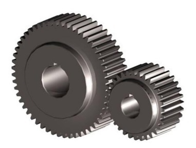

## Introduction

<b>Discipline | <b> Mechanical Engineering 
:--|:--|
<b> Lab | <b> ** Metrology and Measurement Laboratory**
<b> Experiment|     <b> **Measurement of Gear Tooth Profile using Gear Tooth Vernier /Gear Tooth Micrometer and Experiment 5**

### About the Experiment

Gears are toothed wheel that are used to transmit motion from one shaft to another shaft. Gears are generally used for following different reasons:

1. To increase or decrease the speed of rotation
2. To change the amount of force or torque
3. To move rotational motion to a different axis (i.e. parallel, right angles, rotating, linear etc.)
4. To reverse the direction of rotation.

 
<b>Fig. 1. Gears</b>

