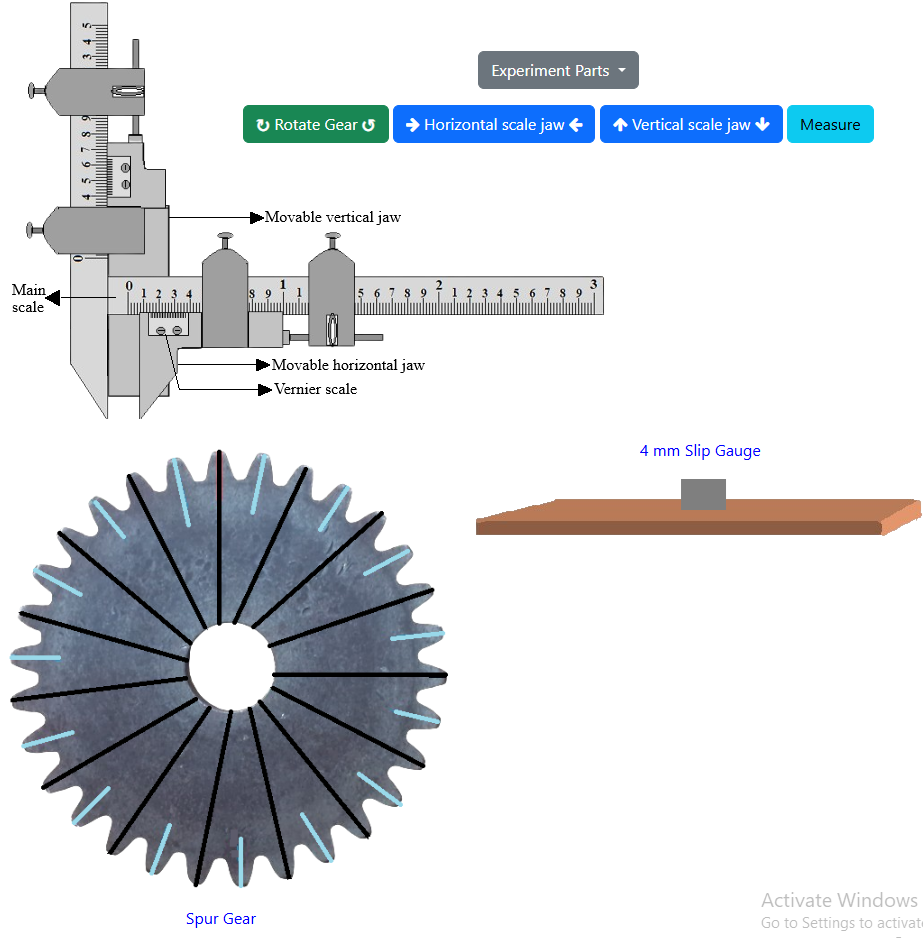
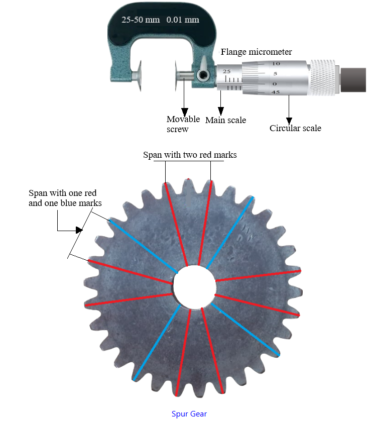

## Procedure

  
<b>Fig. 1. Gear tooth vernier caliper with spur gear</b>         

This experiment is having two parts i) Gear tooth thickness calculation and ii) Span calculation
To follow instructions on the simulation page click on the blue Instructions tab there.

**Gear tooth thickness calculation:**
<ol>

<li> Click on the 4 mm Slip Gauge to place it exactly between the horizontal jaws of gear tooth vernier caliper.</li> 

<li>Click on the 'Right arrow' sign of 'Horizontal scale jaw' to place the '4 mm Slip Gauge' properly according to its width.</li> 

<li>Click on the 4 mm Slip Gauge again to remove it.</li> 

<li>Click on the Spur Gear to place its one tooth (with black mark) exactly between the horizontal jaws of gear tooth vernier caliper.</li> 

<li>Click on the 'Left arrow' sign of 'Horizontal scale jaw' to fix the black marked tooth properly according to its width.</li> 

<li>When it is properly fixed between the jaws one alert message will be seen. It is now properly fixed for a gear tooth so no need to
adjust the horizontal jaw position for rest of the experiment. Click on 'Measure' button to measure the tooth thickness as t1.</li> 

<li>Click on the clockwise arrow sign of 'Rotate Gear' button. The gear will rotate in clockwise direction. Rotate it untill a tooth with black mark
comes between the horizontal jaws of Vernier caliper. Click on 'Measure' button to measure this tooth thickness as t2.</li> 

<li>Again click on the clockwise arrow sign of 'Rotate Gear' button until another tooth with black mark
comes between the horizontaljaws of Vernier caliper. Click on 'Measure' button to measure this tooth thickness as t3.</li> 

<li>Click on 'Table' at the bottom of the page to see the observation table and click on 'Add to Table' button to fill the first row of the observation table.
Click on 'Remeasure' button.</li>  

<li>Follow step 8 for successive three times again and click on 'Measure' button each time to measure the tooth thickness. After taking another
three readings of t1, t2 and t3 follow step 9 to fill the second row of the observation table.
Till now total 6 readings have been taken.</li> 

<li>Follow step 10 until total readings of tooth thickness in observation table is 15.</li> 

<li>Now follow steps 7-11 to measure the thickness of gear teeth (with blue marks). 15 blue marked teeth are there, hence at the end
there would be total 30 thickness readings.</li> 

<li>Under 'Calculations' box enter the maximum and minimum mean tooth thickness values from observation table. Click on 'Calculate' button to see the variation
between them.</li> 

<li> Click on 'Clear' button to erase the observation data. Click on 'Table' button to hide the observation table. </li> 

<li>Click on 'Span' under 'Experiment Parts' to perform second part of this experiment.</li> 

 
</ol>

**Span calculation:**

  
<b>Fig. 2. Flange micrometer with spur gear</b>         

<ol>

<li> Click on the Spur Gear to place it exactly between the screws of flange micrometer.</li> 

<li>Click on the anticlockwise arrow sign of 'Rotate Micrometer' button. The circular scale will rotate, wait until it stops rotating.
Again rotate it to move the movable screw of micrometer towards right side. Rotate until a span of three theeth with two red marks comes
between the screws of micrometer (until an alert message comes ('Fixed properly')). The movable screw is now properly fixed for a span of three gear teeth.
No need to adjust it for rest of the experiment. Click on 'Measure' button to measure this span thickness as Span1.</li> 

<li>Click on the clockwise arrow sign of 'Rotate Gear' button. The gear will rotate in clockwise direction. Rotate it until 
another span of three theeth with two red marks comes between the screws of micrometer. Click on 'Measure' button to measure this span thickness as Span2.
Click on 'Calculate' button to calculate the mean span.</li> 

<li>Click on 'Table' at the bottom of the page to see the observation table and click on 'Add to Table' button to fill the first row of the observation table.</li>  

<li>Follow step 3 for other two successive teeth spans (three teeth) with red marks.</li> 

<li> After taking another two readings of Span1 and Span2 click on 'Calculate' button to calculate the mean span.
Follow step 4 again to fill the second row of the observation table.</li>  

<li>Till now total 4 readings have been taken.</li> 

<li>Now follow steps 3-6 to measure the span of three gear teeth (with one red and one blue marks). 4 teeth spans are there with
one blue and one red mark, hence at the end there would be total 8 span readings.</li> 

<li>Calculate the average Mean Span from the observation table and calculate the variation between theoritical and average mean span value.
The theoritical span value is written in 'Theory' part.</li> 	

<li> Click on 'Clear' button to erase the observation data. Click on 'Table' button to hide the observation table.
The first part of the experiment i.e. 'Gear tooth thickness calculation' can be performed again by clicking on 'Tooth Thickness' under 'Experiment Parts'.</li> 

  
</ol>