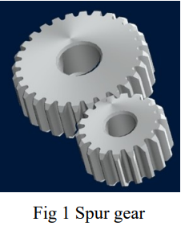
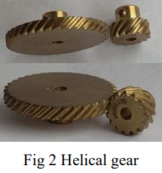
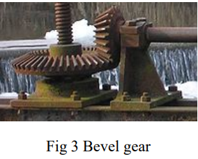
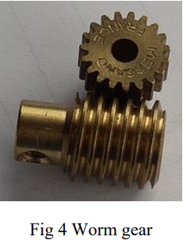
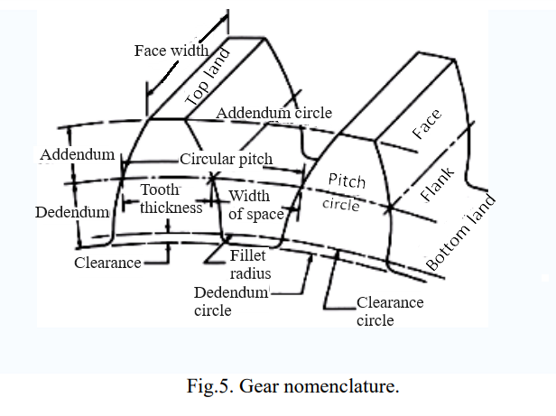
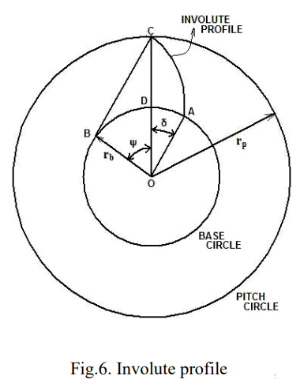
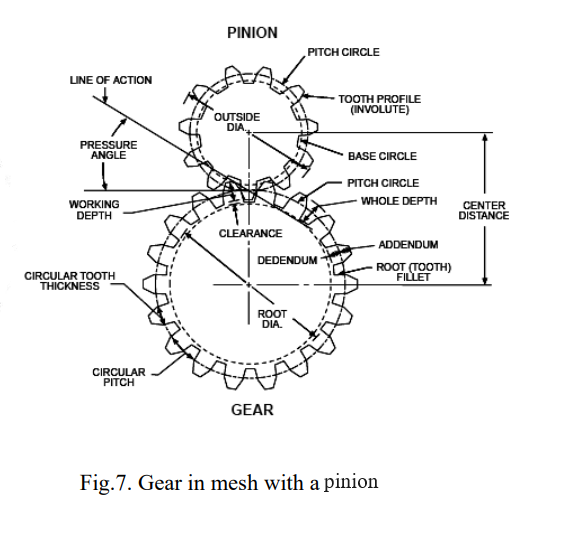
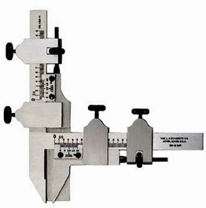
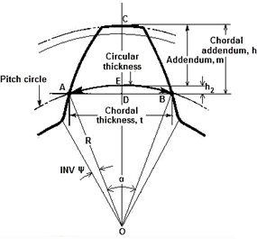
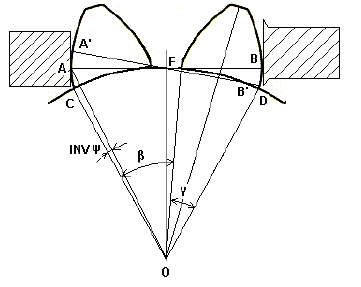

## Theory

Gears are mainly used for the transmission of power and motion. Basically, gears are round wheel with teeth that meshes with another gear, allowing force to be fully transmitted without slippage. Depending on their construction and arrangement, gears can transmit forces from the power source at different speeds, torques, or in different directions. Gear can also mesh with any device having compatible teeth, such as linear moving racks. For closer control over the accuracy of the gear's manufacture, precision measurement of the gear plays a vital role. There are different types of gears based on various application sectors. Some of them are discussed below:

**Spur Gear:** Spur gears are cylindrical-shaped toothed components; the edge of each tooth is straight and aligned parallel to the axis of rotation, figure 1 shows a schematic representation of spur gear. 

**Helical Gear:** In helical gears the leading edges of the teeth are not parallel to the axis of rotation but are set at an angle, as shown in figure 2. The angled teeth engage more gradually than do spur gear teeth. This causes helical gears to run more smoothly and quietly than spur gears.

**Bevel gear:** It has teeth that are not parallel to the rotation axis but conically shaped, as shown in figure 3. The angle between the shafts of mating gears can be anything except zero or 180 degrees. Bevel gears with equal teeth and shaft axis at 90 degrees are called miter gears.

**Worm gear:** It is a type of helical gear. However, its helix angle is usually large, and its body is usually fairly long in the axial direction, as shown in figure 4. These gears are mainly used in applications requiring large gear reductions in compact space. 
				

**Gear Nomenclature:** It describes the various features and characteristics of gears. Some common terms used in gear nomenclature shown in figure 5 are discussed below:

1.	Pitch circle: It is an imaginary circle upon which the pitch diameter is located.

2.	Pitch diameter: The diameter of the imaginary circle that passes through the point where the teeth of two mating gears mesh. 

3.	Pitch: The distance between corresponding points on adjacent teeth, measured along the pitch circle.

4.	Module: It is the ratio of the pitch diameter to the number of teeth.

5.	Diametral Pitch: It is the ratio of the number of teeth to the pitch diameter.

6.	Circular Pitch: The distance measured on the pitch circle from a point on one tooth to the corresponding point on an adjacent tooth, usually measured along the pitch circle arc.

7.	Addendum: The radial distance from the pitch circle to the outside circle of the gear tooth.

8.	Dedendum: The radial distance from the pitch circle to the root circle of the gear tooth.

9.	Clearance: The difference between the dedendum of one gear and addendum of the mating gear. It provides space for the teeth of the mating gears to mesh without interference.

**Gear geometric nomenclature:**

The tooth thickness is often measured at the pitch circle, as shown in figure 6. The most commonly used curve for gear-tooth profiles is the involute of a circle. It can be described as the curve drawn by a point on a taut (line BC in the figure 6), an inextensible string as it unwinds from another circle. The circle from which the involute is formed is called the base circle. The involute profile is shown in the figure 6. The pressure angle is defined as the angle between the line of action and the common tangent to the pitch circles shown in figure 7. The base and pitch radius are denoted by rb and rp respectively. The pitch circle radius is denoted by R. 
						

From the Fig.6,

$$OB = OC \ cos \Psi = r_b$$

$$BC = arc \ AB = r_b \ tan \Psi$$

$$Arc \ BD = r_b \Psi \ (radians)$$

$$r_b \delta = r_b tan \Psi - r_b \Psi$$

$$\delta = tan \Psi - \Psi (radians)$$

**Tooth thickness measurement by Gear Tooth Vernier Calliper:**

Tooth thickness is measured by the gear tooth Vernier calliper as shown in figure 8. Since the gear tooth thickness varies from root to the tip, Vernier must be capable of measuring the tooth thickness at a specified location on the tooth. The tooth thickness is measured at the pitch circle as shown in figure 9. The thickness of tooth at pitch line and the addendum is measured by an adjustable tongue, each of which is adjusted independently by adjustable screws on the graduated bars. The gear tooth Vernier is set with its vertical scale at a distance equal to chordal addendum so that the thin slit will be at height ‘m’ from the tip of the jaw. Hence the gear tooth slit will be on top land and the tip of the jaws will measure the chordal thickness, ‘t’.

<b>Fig.8 Gear tooth vernier calliper </b>

<b>Fig.9 Gear tooth geometry</b>

$$h = (m + h_2)$$
$$t = AB = 2AD$$
$$\angle AOD = \alpha / 2 = 2 \Pi / 4 N = \Pi / 2N$$

Where, R = Pitch Circle Radius = Nm/2

$$T = 2 AO \ sin \ (\alpha / 2) = 2 R \ sin \ (\Pi / \ 2 N)$$
$$T = Nm \ sin \ (\Pi / \ 2 N)$$

$$h_2 = DE = R \ (1 - cos \ (\alpha / 2)) = \frac{Nm}{2} (1 - cos \ \Pi / 2 N)$$

“t” is the chord ADB while tooth thickness is arc AEB. Therefore, the tooth thickness thus measures is called as chordal tooth thickness.

**Tooth thickness measurement by Flange Micrometer:**

Flange micrometer is used for the measurement of gear span. It is specialised type of micrometer used to measure the thickness of flange or the distance between two surfaces, such as face of flange and another surface it interfaces with. It typically consists of a frame, anvil, spindle and thimble . The spindle is brought into contact with one surface, and the thimble is rotated to bring the spindle into contact with the other surface. AF + FB = A′F + FB′ = arc length CD along the base circle as shown in figure 10.
Hence the measurement of span AB can be taken in any position with the Flange micrometer touching tooth flange. Any tooth thickness error will show a corresponding error in the value of AB.

Let the number of teeth in the span of AB be “n”.

then,
$$\beta = \frac{(n-1)2\pi}{N}$$

$$OD = \frac{N m \ cos(\gamma/2)}{2}$$

<b>Fig.10 Measurement of tooth thickness error</b>

where,
$$inv \ \psi = tan \psi -\psi(radians)$$
$$CD = (\beta + \gamma)OD$$
$$AB =CD = A'B'$$
$$AB = \frac{(\beta + \gamma)}{2}Nm \ cos\frac{\gamma}{2}$$

where,
$$\alpha = \frac{\pi}{N}$$
$$\beta = \frac{(n-1)2\pi}{N}$$
$$\gamma = 2 inv \ \psi$$

The optimum number of teeth “n” for the measurement of the span can be found by taking the contact points near the pitch points.

$$AB = AF + FB = CD = 2OF(\psi + INV \ \psi )$$

n = nearest integer to $$\frac{AB \times N}{\pi N m \ cos \psi} = \frac{N(\psi + inv \ \psi)}{\pi}$$

$$n = \frac{N \ tan \ \psi}{\pi}$$

here, 
$$\psi = 20 ^{\circ}$$

Theoretically the value of the span can be calculated by 

$$AB = \frac{(\beta + \gamma)N m \ cos (\gamma/2)}{2}$$
$$inv \psi = tan \ \psi - \psi = tan \ 20 ^{\circ} - 20\frac{\pi}{180}$$

								