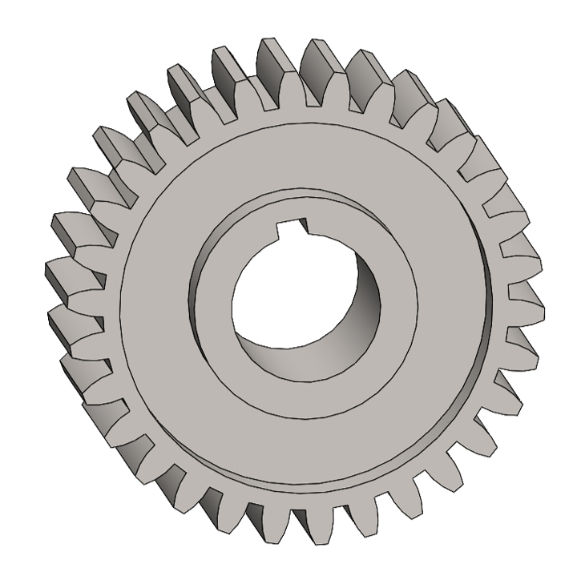
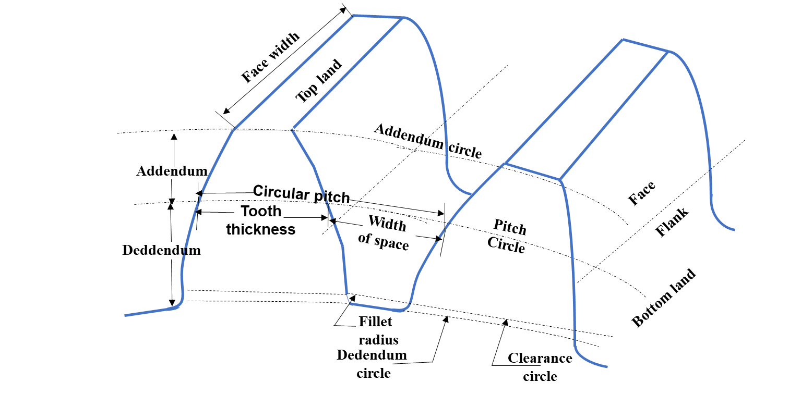
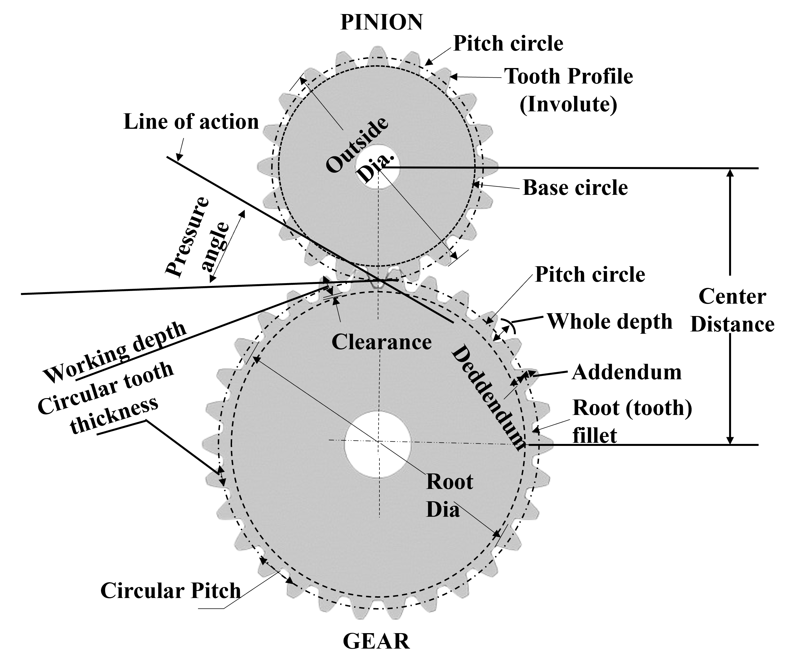
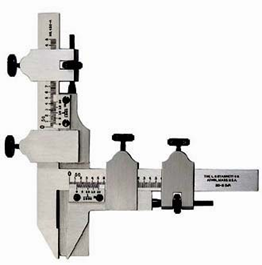
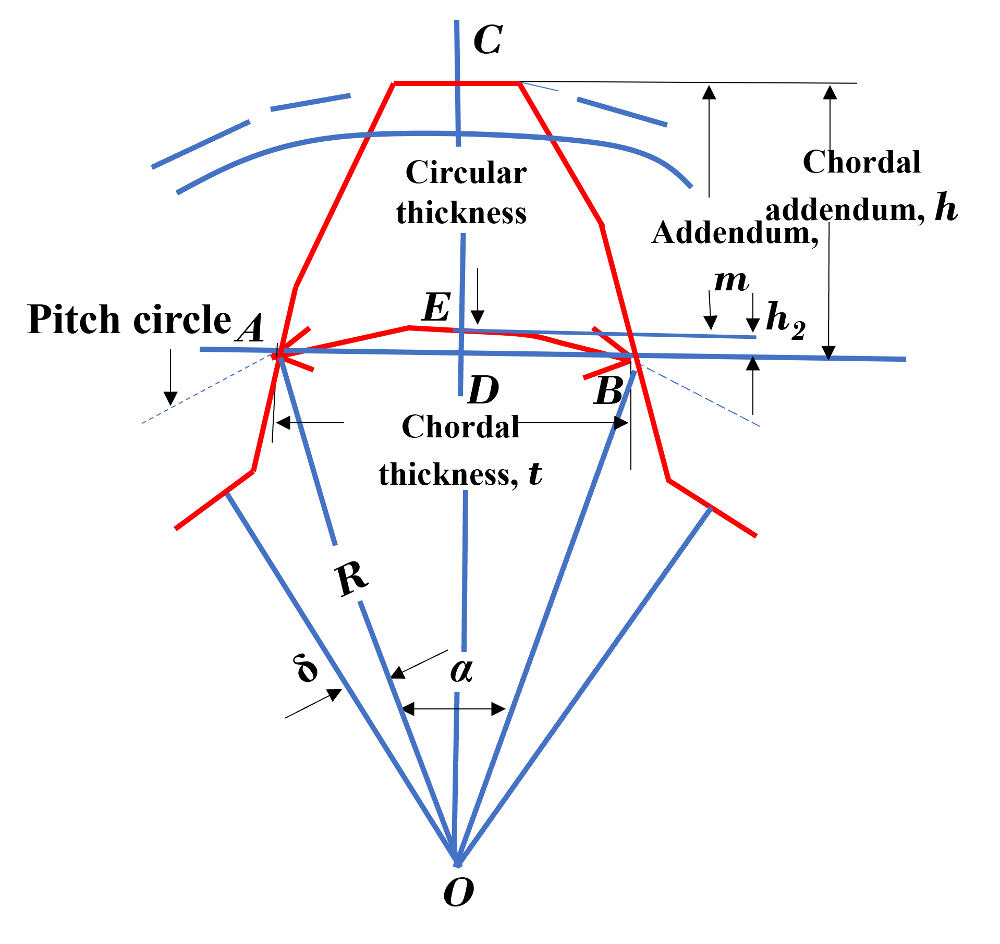
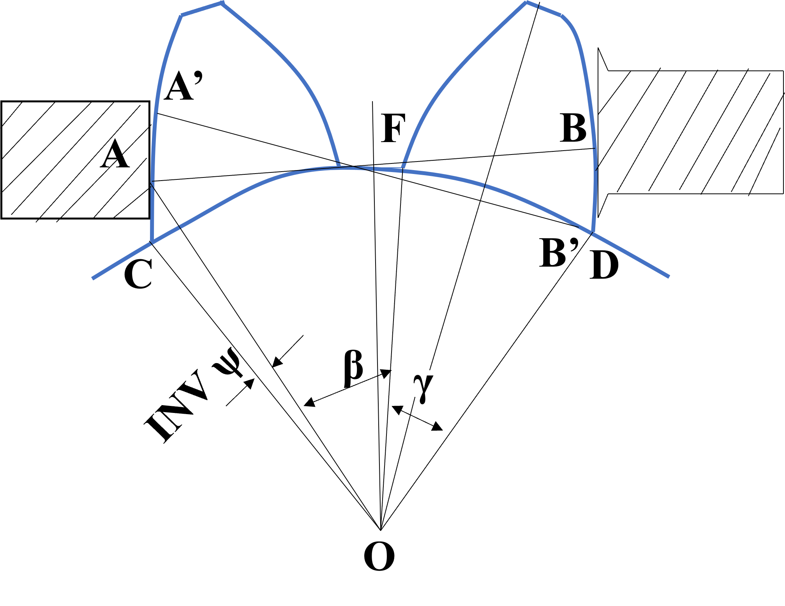

## Theory

Gears are mainly used for the transmission of power and motion. Basically, gears are rotating machine part with teeth that meshing with another gear tooth, allowing force to be fully transmitted without slippage. Based on their design and arrangement, gears can transmit forces from the power source, while changing the speed, torque or the direction of motion. Gear can also mesh with any device having compatible teeth, such as linear moving racks. For closer control over the accuracy of the gear's manufacture, precision measurement of the gear plays a vital role. There are different types of gears based on various application sectors. One of them is discussed below:

**Spur Gear:** Spur gears are cylindrical-shaped toothed components; the edge of each tooth is straight and aligned parallel to the axis of rotation, Fig. 1 shows a schematic representation of spur gear.

<b>Fig. 1. Spur gear</b>

**Gear Nomenclature:** It describes the various features and characteristics of gears. Some common terms used in gear nomenclature shown in Fig. 2 are discussed below:

<b>Fig. 2. Gear nomenclature</b>

1.	Pitch circle: It is an imaginary circle upon which the pitch diameter is located.

2.	Pitch diameter: The diameter of the imaginary circle that passes through the point where the teeth of two mating gears mesh. 

3.	Module: It is the ratio of the pitch diameter to the number of teeth for a specific gear.

4.	Circular Pitch: The distance measured on the pitch circle from a point on one tooth to the corresponding point on an adjacent tooth, usually measured along the pitch circle arc.

5.	Addendum: The radial distance from the pitch circle to the top land of the gear tooth.

6.	Dedendum: The radial distance from the pitch circle to the base circle of the gear tooth.

7.	Clearance: The difference between the dedendum of one gear and addendum of the mating gear. It provides space for the teeth of the mating gears to mesh without interference.

**Gear geometric nomenclature:**

The tooth thickness is often measured at the pitch circle, as shown in Fig.3. The most commonly used curve for gear-tooth profiles is the involute of a circle. It can be described as the curve traced by a point on an inextensible string (line BC in Fig.3) as it unwinds from circle. The circle from which the involute is formed is called the base circle. The involute profile is shown in the Fig. 3. The pressure angle is defined as the angle between the line of action and the common tangent to the pitch circles shown in Fig. 4. The base and pitch radius are denoted by rb and rp respectively. The pitch circle radius is denoted by R. The involute function (&delta;) is required for the gears to ensure a constant velocity ratio and smooth, efficient power transmission. It is derived from the fundamental principle of involute.
						

<b>Fig. 3. Involute profile </b>

<b>Fig. 4. Gear in mesh with pinion</b>

From the Fig. 3 involute profile can be seen 

$$OB = OC \ cos \psi = r_b \tag{1}$$

$$BC = arc \ AB = r_b \ tan \psi \tag{2}$$

$$Arc \ BD = r_b \ \psi \ (radians) \tag{3}$$

$$r_b \ \delta = r_b \ tan \psi - r_b \ \psi \tag{4}$$

$$\delta = tan \ \psi - \psi \ (radians) \tag{5}$$

**Tooth thickness measurement by Gear Tooth Vernier Calliper:**

Tooth thickness is measured by the gear tooth Vernier calliper as shown in Fig. 5. Since the gear tooth thickness varies from root to the tip, Vernier must be capable of measuring the tooth thickness at a specified location on the tooth. The tooth thickness is measured at the pitch circle as shown in Fig. 6. The thickness of tooth at pitch circle and the addendum is measured by an adjustable tongue, each of which is adjusted independently by adjustable screws on the graduated bars. The gear tooth Vernier is set with its vertical scale at a distance equal to chordal addendum so that the thin slit will be at height ‘m’ from the tip of the jaw. Hence the gear tooth slit will be on top land and the tip of the jaws will measure the chordal thickness, ‘t’.

<b>Fig. 5. Gear tooth vernier calliper </b>

<b>Fig. 6. Gear tooth geometry</b>

From Fig. 6,

$$Chordal \ addendum, \ h = (m + h_2) \tag{6}$$

$$Chordal \ thickness, \ t = AB = 2AD \tag{7}$$

$$\angle AOD = \alpha / 2 = 2 \Pi / 4 N = \Pi / 2N \tag{8}$$ 

$$R = \ Pitch \ Circle \ Radius = \frac{N m}{2} \tag{9}$$

$$t = 2 AO \ sin \ (\alpha / 2) = 2 R \ sin \ (\Pi / \ 2 N) \tag{10}$$

$$t = N m \ sin \ (\Pi / \ 2 N) \tag{11}$$

$$h_2 = DE = R \ (1 - cos \ (\alpha / 2)) = \frac{N m}{2} (1 - cos \ \Pi / 2 N) \tag{12}$$

“t” is the chord ADB while tooth thickness is arc AEB. Therefore, the tooth thickness thus measured is called as chordal tooth thickness.

**Tooth thickness measurement by Flange Micrometer:**

Flange micrometer is used for the measurement of gear span. It is specialised type of micrometer used to measure the thickness of flange or the distance between two surfaces, such as face of flange and another surface it interfaces with. It typically consists of a frame, anvil, spindle and thimble . The spindle is brought into contact with one surface, and the thimble is rotated to bring the spindle into contact with the other surface to measure the gear span.
From the principle of the involute profile the sum of the generators 
AF + FB = A'F + FB' = arc length CD along the base circle as shown in Fig. 7. 

<b>Fig. 7. Measurement of tooth thickness error</b>

Hence the measurement of span AB can be taken in any position with the Flange micrometer touching tooth flange. Any tooth thickness error will show a corresponding error in the value of AB. 

Let the number of teeth in the span of AB be “n”.

then,
$$\beta = \frac{(n-1)2\pi}{N} \tag{13}$$

$$\beta = \frac{N m cos (\frac{\psi}{2})}{2} \tag{14}$$

$$OD = \frac{N m \ cos(\gamma/2)}{2}$$

where,
$$inv \ \psi = tan \psi -\psi (radians) \tag{15}$$

$$CD = (\beta + \gamma) OD \tag{16}$$

$$AB = CD = A'B' \tag{17}$$

$$AB = \frac{(\beta + \gamma)}{2} N m \ cos\frac{\gamma}{2} \tag{18}$$

where,
$$\alpha = \frac{\pi}{N} \tag{19}$$

$$\beta = \frac{(n-1)2\pi}{N} \tag{20}$$

$$\gamma = 2 inv \ \psi \tag{21}$$

The optimum number of teeth “n” for the measurement of the span can be found by taking the contact points near the pitch points.

$$AB = AF + FB = CD = 2OF(\psi + INV \ \psi ) \tag{22}$$

n = nearest integer to $$\frac{AB \times N}{\pi N m \ cos \psi} = \frac{N(\psi + inv \ \psi)}{\pi} \tag{23}$$

$$n = \frac{N \ tan \ \psi}{\pi}, \ here, \psi = 20 ^{\circ} \tag{24}$$

Theoretically the value of the span can be calculated by 

$$AB = \frac{(\beta + \gamma)N m \ cos (\gamma/2)}{2} \tag{25}$$

$$inv \ \psi = tan \ \psi - \psi = tan \ 20 ^{\circ} - 20\frac{\pi}{180} (radians) \tag{26}$$

								