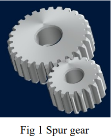
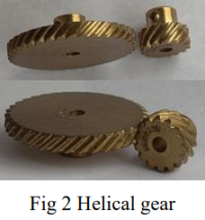
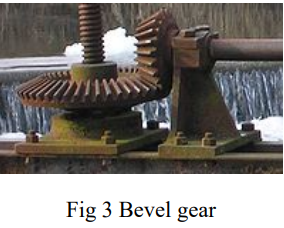
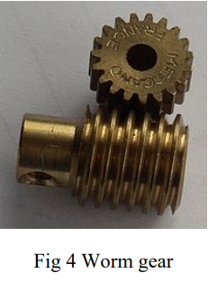
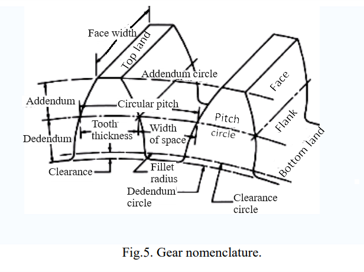
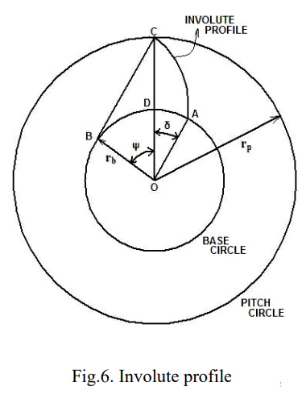
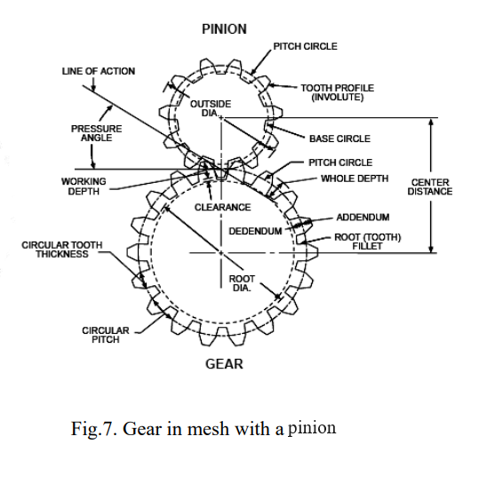
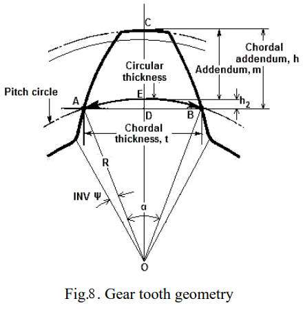
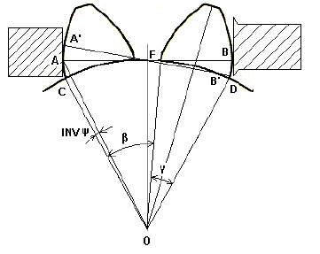

## Theory

Gears are mainly used for transmission of power and motion. It is a round wheel that has 
teeth, which meshes with another gear allowing force to be fully transferred without slippage.
Depending on their construction and arrangement, geared devices can transmit forces at 
different speeds, torques, or in a different direction, from the power source. A gear can also
mesh with any device having compatible teeth, such as linear moving racks. For closer
control over the accuracy of manufacture of the gear, precision measurement of gear plays a 
vital role. A brief overview of different types of gear has been documented herewith.

**Spur Gear** - The edge of each tooth is straight and aligned parallel to the axis of rotation. 

**Helical Gear** - The leading edges of the teeth are not parallel to the axis of rotation, but are 
set at an angle. The angled teeth engage more gradually than do spur gear teeth. This causes 
helical gears to run more smoothly and quietly than spur gears. 

**Bevel gear** - The angle between the shafts of mating gears can be anything except zero or 180 
degrees. Bevel gears with equal numbers of teeth and shaft axes at 90 degrees are called 
miter gears. 

**Worm gear** – Type of helical gear, but its helix angle is usually somewhat large and its body 
is usually fairly long in the axial direction; and it is these attributes which give it screw like 
qualities. 
				

**Gear geometric nomenclature:**

The tooth thickness is generally measured at pitch circle shown in Fig 5. The curve most 
commonly used for gear-tooth profile is the involute of a circle. It may be defined as the 
curve traced by a point on a taut (line BC in Fig.6), inextensible string as it unwinds from 
another circle. The circle from which the involute is derived is called the base circle. The 
involute profile is shown in Fig.6. Pressure Angle (ψ ) is defined as the angle between the 
line of action and the common tangent to the pitch circles shown in Fig.7. The base radius 
and the pitch radius are rb and rp respectively. Pitch circle radius is denoted by symbol R. The 
involute function ( ∂ ) is found from the fundamental principle of involute.
						

From the Fig.6,

$$OB = OC \ cos \Psi = r_b$$

$$BC = arc \ AB = r_b \ tan \Psi$$

$$Arc \ BD = r_b \Psi \ (radians)$$

$$r_b \delta = r_b tan \Psi - r_b \Psi$$

$$\delta = tan \Psi - \Psi (radians)$$

The following gear tooth elements are measured using vernier 
• Outside diameter

• Diametral pitch 

• Pitch circle diameter 

• Module

• Addendum 

• Dedendum 

• Tooth thickness of all teeth

**Outside diameter (O.D):** Using vernier caliper, the outer diameter of the given gear is measured.

**Diametral pitch (Dp):** Diametral pitch = (N+2) / Outside diameter 

Where, N= Number of teeth

**Pitch circle diameter (P.C.D):** Pitch circle diameter = N / Diametral pitch 

**Module (m):** Module = 1 / Diametral pitch

**Addendum (a):** Addendum = Module 

**Dedendum (d):** Dedendum = 1.157 X (Addendum) 

**Tooth thickness (t):**

Tooth thickness is measured by the gear tooth vernier. Since the gear tooth thickness varies from the 
root to the tip, the vernier must be capable of measuring the tooth thickness at a specified 
position on the tooth. The tooth thickness is measured at the pitch circle as shown in Fig.8. 
The thickness of the tooth at pitch line and the addendum is measured by an adjustable 
tongue, each of which is adjusted independently by adjustable screws on the graduated bars. 
The gear tooth vernier is set with its vertical scale at a distance equal to chordal addendum so 
that the thin slit will be at a height ‘m’ from the tip of the jaw. Hence the gear tooth slit will 
sit on the top land and the tip of the jaws will measure the chordal thickness, t.

$$h = (m + h_2)$$
$$t = AB = 2AD$$
$$\angle AOD = \alpha / 2 = 2 \Pi / 4 N = \Pi / 2N$$

Where, R = Pitch Circle Radius = Nm/2

$$t = 2 AO sin(\alpha / 2) = 2 R sin(\Pi /2 N)$$
$$t = N m sin (\Pi / 2 N)$$

$$h_2 = DE = R(1 - cos (\alpha / 2)) = \frac{Nm}{2} (1 - cos \Pi / 2 N)$$

“t” is the chord ADB while tooth thickness is the arc AEB. Therefore the tooth thickness thus 
measured is called “Chordal tooth thickness”.

The measurement of tooth thickness (t1) is started from any one tooth by marking it Leaving one tooth the next one is measured as t2. Leaving another tooth the next one is measured as t3. The procedure is followed till all the 30 teeth are measured.

**Span Measurement**

Considering the below figure ,

AF + FB = A′F + FB′ = arc length CD along the base circle as shown in figure 9.
Hence the measurement of the span AB can be taken in any position with the Flange
Micrometer touching tooth flange. Any tooth thickness error will show a corresponding error
in the value of AB.
Let the number of teeth in the span of AB be “n”.

then,
$$\beta = \frac{(n-1)2\pi}{N}$$

$$OD = \frac{N m cos(\gamma/2)}{2}$$

$$\gamma = 2 inv \psi$$
where,
$$inv \psi = tan \psi -\psi(radians)$$
$$CD = (\beta + \gamma)OD$$
$$AB =CD = A'B'$$
$$AB = \frac{(\beta + \gamma)}{2}Nm cos\frac{\gamma}{2}$$

where,
$$\alpha = \frac{\pi}{N}$$
$$\beta = \frac{(n-1)2\pi}{N}$$
$$\gamma = 2 inv \psi$$

The optimum number of teeth “n” for the measurement of the span can be found by taking
the contact points near the pitch points.
$$AB = AF + FB = CD = 2OF(\psi + inv \psi )$$

n = nearest integer to $$\frac{AB \times N}{\pi N m \ cos \psi} = \frac{N(\psi + inv \psi)}{\pi}$$

$$n = \frac{N tan \psi}{\pi}$$

here, 
$$\psi = 20\deg$$
$$N = 30$$

Maximum variation in values of the span measured =
Theoretically the value of the span is given by

$$AB = \frac{(\beta + \gamma)N m cos (\gamma/2)}{}$$
$$inv \psi = tan \psi - \psi = tan 20 \deg - 20\frac{\pi}{180}$$

Appoximately it is 33.135 mm.
Difference between the theoretical and observed values is measured in mm.

								